# OverLORD - Official PyTorch Implementation
> [Scaling-up Disentanglement for Image Translation](http://www.vision.huji.ac.il/overlord)  
> Aviv Gabbay and Yedid Hoshen  
> International Conference on Computer Vision (ICCV), 2021.

> **Abstract:** Image translation methods typically aim to manipulate a set of labeled attributes (given as supervision at training time e.g. domain label) while leaving the unlabeled attributes intact. Current methods achieve either: (i) disentanglement, which exhibits low visual fidelity and can only be satisfied where the attributes are perfectly uncorrelated. (ii) visually-plausible translations, which are clearly not disentangled. In this work, we propose OverLORD, a single framework for disentangling labeled and unlabeled attributes as well as synthesizing high-fidelity images, which is composed of two stages; (i) Disentanglement: Learning disentangled representations with latent optimization. Differently from previous approaches, we do not rely on adversarial training or any architectural biases. (ii) Synthesis: Training feed-forward encoders for inferring the learned attributes and tuning the generator in an adversarial manner to increase the perceptual quality. When the labeled and unlabeled attributes are correlated, we model an additional representation that accounts for the correlated attributes and improves disentanglement. We highlight that our flexible framework covers multiple settings as disentangling labeled attributes, pose and appearance, localized concepts, and shape and texture. We present significantly better disentanglement with higher translation quality and greater output diversity than state-of-the-art methods.

<a href="https://arxiv.org/abs/2103.14017" target="_blank"></a> <a href="https://replicate.ai/avivga/overlord" target="_blank"></a>

## Description
A framework for high-fidelity disentanglement of labeled and unlabeled attributes. We support two general cases: (i) The labeled and unlabeled attributes are *approximately uncorrelated*. (ii) The labeled and unlabeled attributes are *correlated*. For this case, we suggest simple forms of transformations for learning *pose-independent* or *localized* correlated attributes, by which we achieve better disentanglement both quantitatively and qualitatively than state-of-the-art methods.

### Case 1: Uncorrelated Labeled and Unlabeled Attributes
- Facial age editing: Disentanglement of labeled age and uncorrelated unlabeled attributes (FFHQ).

| Input | [0-9] | [10-19] | [50-59] | [70-79] |
|:---:|:---:|:---:|:---:|:---:|
|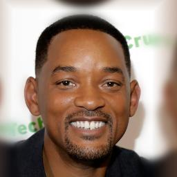||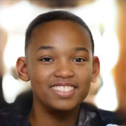|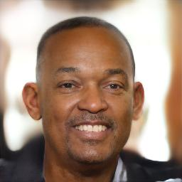|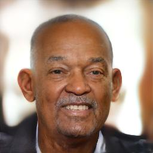|
|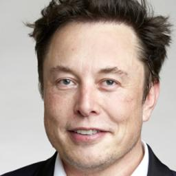|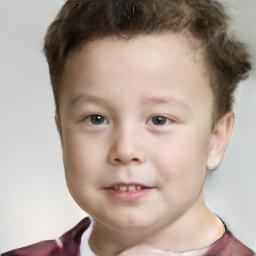|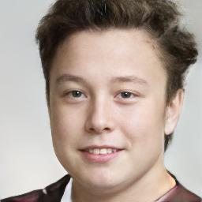||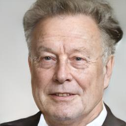|

- Disentanglement of labeled identity and uncorrelated unlabeled attributes (CelebA).

| Identity | Attributes #1 | Translation #1 | Attributes #2 | Translation #2 |
|:---:|:---:|:---:|:---:|:---:|
||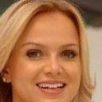||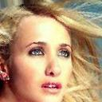|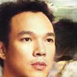|
|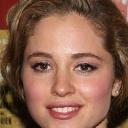||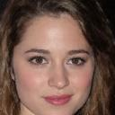|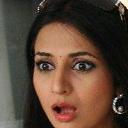|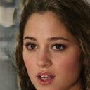|

- Disentanglement of labeled shape (edge map) and unlabeled texture (Edges2Shoes).

| Texture | Shape #1 | Translation #1 | Shape #2 | Translation #2 |
|:---:|:---:|:---:|:---:|:---:|
|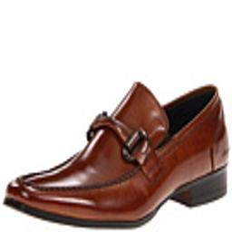|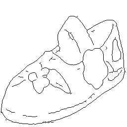|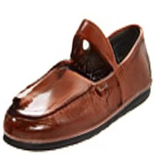|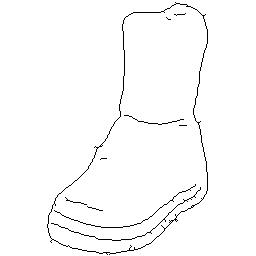|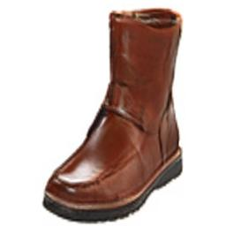|
|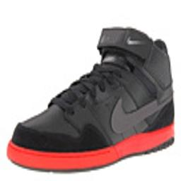|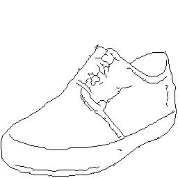|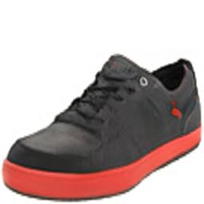||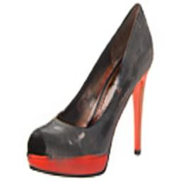|

### Case 2: Correlated Labeled and Unlabeled Attributes
- Disentanglement of domain label (cat, dog or wild), correlated appearance and *uncorrelated pose*.
FUNIT and StarGAN-v2 rely on architectural biases that tightly preserve the spatial structure, leading to unreliable
facial shapes which are unique to the source domain. We disentangle the pose and capture the appearance of the target breed faithfully.

| Pose | Appearance | FUNIT | StarGAN-v2 | Ours |
|:---:|:---:|:---:|:---:|:---:|
|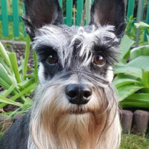|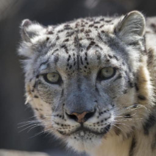|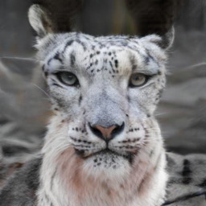|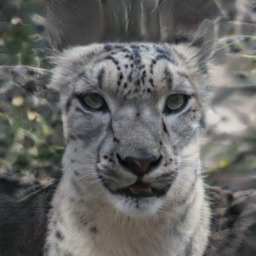||
|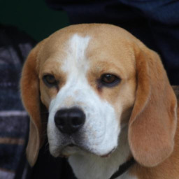|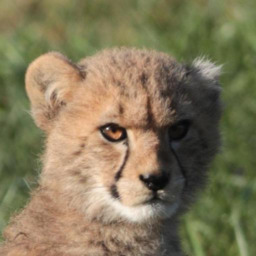|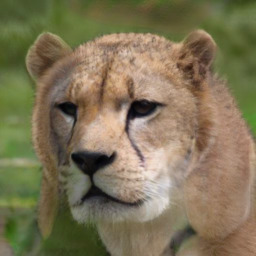|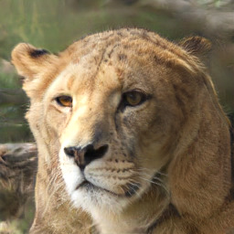|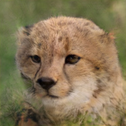|

- Male-to-Female translation in two settings: (i) When the gender is assumed to be *approximately uncorrelated* with all the unlabeled attributes. (ii) When we model the hairstyle as *localized correlation* and utilize a reference image specifying its target.

| Input | Ours [uncorrelated] | Reference | StarGAN-v2 | Ours [correlated] |
|:---:|:---:|:---:|:---:|:---:|
|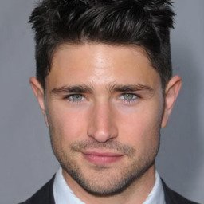|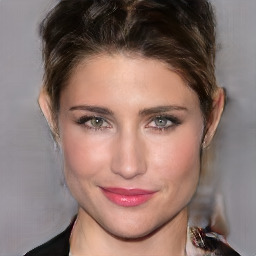|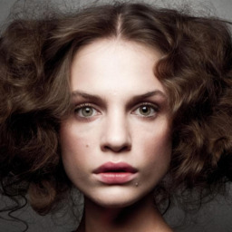|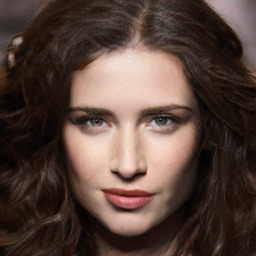|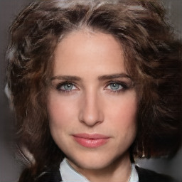|
|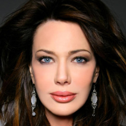|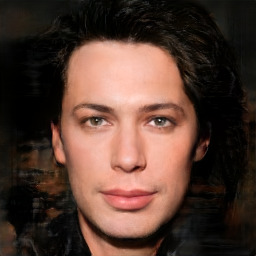|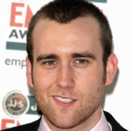|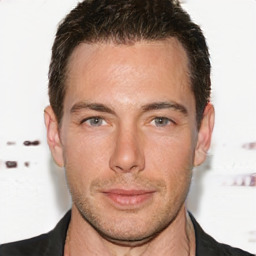|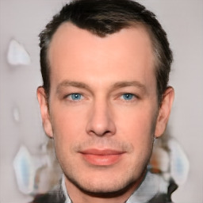|

## Requirements


This repository imports modules from the StyleGAN2 architecture (**not pretrained**).
Clone the following repository:
```
git clone https://github.com/rosinality/stylegan2-pytorch
```
Add the local StyleGAN2 project to PYTHONPATH. For bash users:
```
export PYTHONPATH=<path-to-stylegan2-project>
```

## Training
In order to train a model from scratch, do the following preprocessing and training steps.
First, create a directory (can be specified by `--base-dir` or set to current working directory by default) for the training artifacts (preprocessed data, models, training logs, etc).

### Facial Age Editing (FFHQ):
Download the [FFHQ dataset](https://github.com/NVlabs/ffhq-dataset) and [annotations](https://github.com/DCGM/ffhq-features-dataset).
Create a directory named `ffhq-dataset` with all the png images placed in a single `imgs` subdir and all the json annotations placed in a `features` subdir.
```
python main.py preprocess --dataset-id ffhq --dataset-path ffhq-dataset --out-data-name ffhq-x256-age
python main.py train --config ffhq --data-name ffhq-x256-age --model-name overlord-ffhq-x256-age
```

### Facial Identity Disentanglement (CelebA)
Download the [aligned and cropped images](https://drive.google.com/open?id=0B7EVK8r0v71pWEZsZE9oNnFzTm8) from the [CelebA dataset](https://mmlab.ie.cuhk.edu.hk/projects/CelebA.html) to a new directory named `celeba-dataset`.
```
python main.py preprocess --dataset-id celeba --dataset-path celeba-dataset --out-data-name celeba-x128-identity
python main.py train --config celeba --data-name celeba-x128-identity --model-name overlord-celeba-x128-identity
```

### Pose and Appearance Disentanglement (AFHQ)
Download the [AFHQ dataset](https://github.com/clovaai/stargan-v2/blob/master/README.md#animal-faces-hq-dataset-afhq) to a new directory named `afhq-dataset`.
```
python main.py preprocess --dataset-id afhq --dataset-path afhq-dataset --split train --out-data-name afhq-x256
python main.py train --config afhq --data-name afhq-x256 --model-name overlord-afhq-x256
```

### Male-to-Female Translation (CelebA-HQ)
Download the [CelebA-HQ dataset](https://github.com/tkarras/progressive_growing_of_gans) and create a directory named `celebahq-dataset` with all the images placed in a single `imgs` subdir. Download [CelebAMask-HQ](https://drive.google.com/open?id=1badu11NqxGf6qM3PTTooQDJvQbejgbTv) from [MaskGAN](https://github.com/switchablenorms/CelebAMask-HQ) and extract as another subdir under the dataset root directory.

```
python main.py preprocess --dataset-id celebahq --dataset-path celebahq-dataset --out-data-name celebahq-x256-gender
```

Training a model for the *uncorrelated* case:
```
python main.py train --config celebahq --data-name celebahq-x256-gender --model-name overlord-celebahq-x256-gender
```

Training a model with modeling hairstyle as *localized correlation*:

```
python main.py train --config celebahq_hair --data-name celebahq-x256-gender --model-name overlord-celebahq-x256-gender-hair
```

#### Resources
The training automatically detects all the available gpus and applies multi-gpu mode if available.

#### Logs
During training, loss metrics and translation visualizations are logged with tensorboard and can be viewed by:
```
tensorboard --logdir <base-dir>/cache/tensorboard --load_fast true
```

## Pretrained Models
We provide several pretrained models for the main experiments presented in the paper. Please download the entire directory of each model and place it under `<base-dir>/cache/models`.

| Model                              | Description                                                                                           |
|:-----------------------------------|:------------------------------------------------------------------------------------------------------|
| [overlord-ffhq-x256-age](https://drive.google.com/drive/folders/1xRKNxU5JfY8JL6aOLWH0XhZe2jPxhHd4?usp=sharing)             | OverLORD trained on FFHQ for facial age editing.                                                      |
| [overlord-celeba-x128-identity](https://drive.google.com/drive/folders/1o8vtAcMsP9pAtg3mXgnLxkTtaSSHOgQ0?usp=sharing)      | OverLORD trained on CelebA for facial identity disentanglement.                                       |
| [overlord-afhq-x256](https://drive.google.com/drive/folders/1Ik7Mw3iqrgB9AQ2CaI7p-3Bojw7tijlX?usp=sharing)                 | OverLORD trained on AFHQ for pose and appearance disentanglement.                                     |
| [overlord-celebahq-x256-gender](https://drive.google.com/drive/folders/1eaibFXfP68mIumgwYoJfZJPKAlCR3n-D?usp=sharing)      | OverLORD trained on CelebA-HQ for male-to-female translation.                                         |
| [overlord-celebahq-x256-gender-hair](https://drive.google.com/drive/folders/1AMtUSkhEUkdUg2jW6mWmQwSVIHgvg2eX?usp=sharing) | OverLORD trained on CelebA-HQ for male-to-female translation with hairstyle as localized correlation. |

## Inference
Given a trained model (either pretrained or trained from scratch), a test image can be manipulated as follows:
```
python main.py manipulate --model-name overlord-ffhq-x256-age --img face.png --output face_in_all_ages.png
python main.py manipulate --model-name overlord-celeba-x128-identity --img attributes.png --reference identity.png --output translation.png
python main.py manipulate --model-name overlord-afhq-x256 --img pose.png --reference appearance.png --output translation.png
python main.py manipulate --model-name overlord-celebahq-x256-gender --img face.png --output face_in_all_genders.png
python main.py manipulate --model-name overlord-celebahq-x256-gender-hair --img face.png --reference hairstyle.png --output translation.png
```

**Note:** Face manipulation models are very sensitive to the face alignment. The target face should be aligned exactly as done in the pipeline which CelebA-HQ and FFHQ were created by. Use the alignment method implemented [here](https://github.com/Puzer/stylegan-encoder/blob/master/align_images.py) before applying any of the human face manipulation models on external images.

## Citation
```
@inproceedings{gabbay2021overlord,
  author    = {Aviv Gabbay and Yedid Hoshen},
  title     = {Scaling-up Disentanglement for Image Translation},
  booktitle = {International Conference on Computer Vision (ICCV)},
  year      = {2021}
}
```
